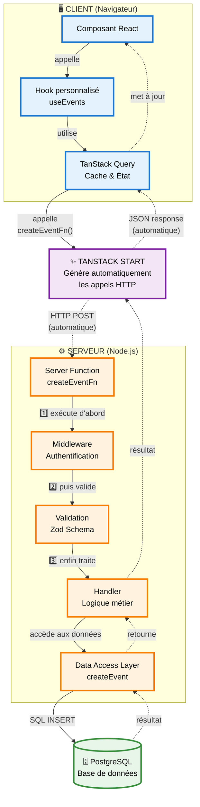
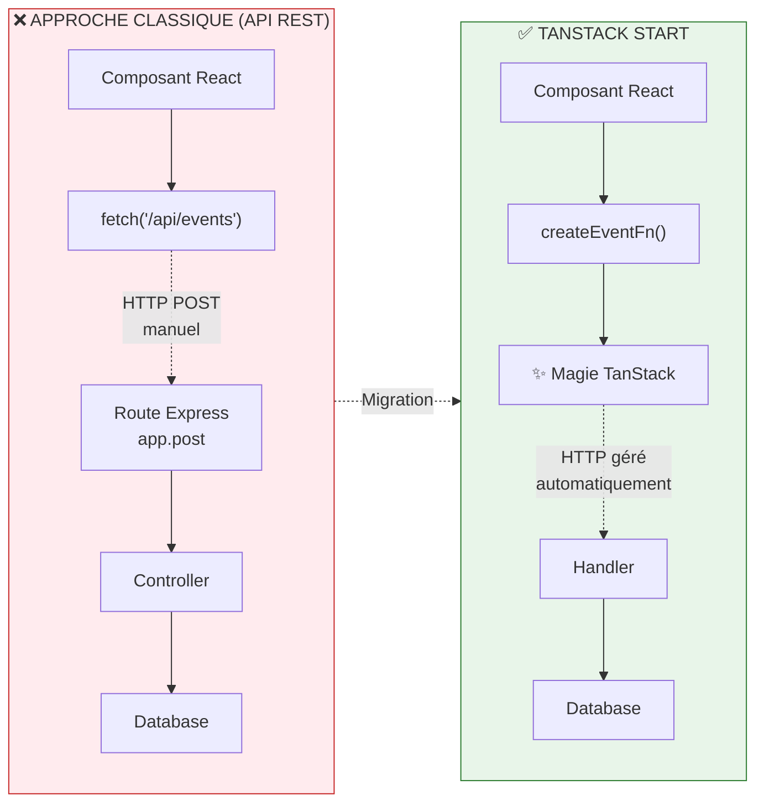
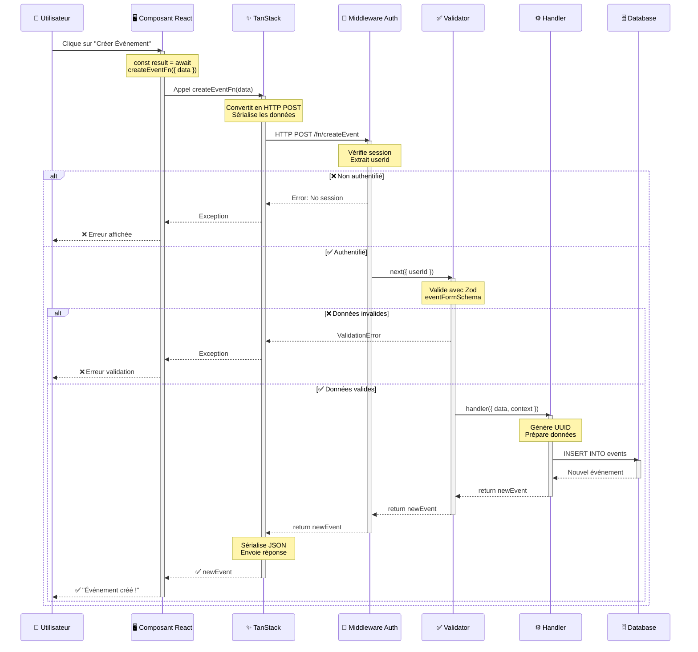
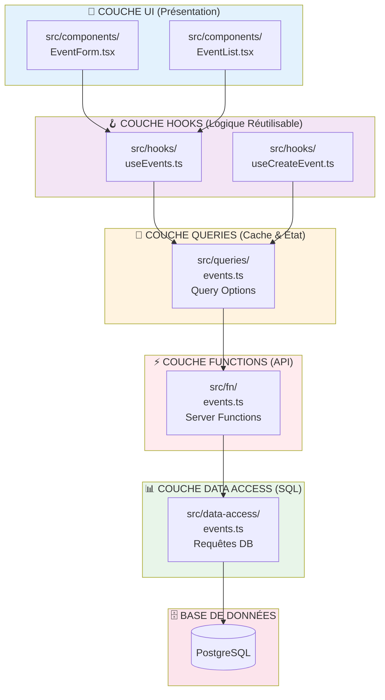

# Guide Pédagogique : TanStack Start Server Functions

## 🎯 Prompt pour Génération de Schéma Pédagogique

### Contexte
TanStack Start utilise des "Server Functions" qui permettent d'appeler du code serveur directement depuis le client, sans créer d'API REST traditionnelle.

### Objectif du Schéma
Créer un diagramme pédagogique qui explique visuellement :
1. Le flux de données entre client et serveur
2. Les différentes couches d'abstraction
3. Le rôle des middlewares et de la validation
4. La comparaison avec une approche API REST classique

---

## 📊 Schéma Architectural



---

## 🔄 Comparaison : Ancien vs Nouveau Modèle



---

## 🎓 Exemple Concret Annoté



---

## 🏗️ Architecture en Couches du Projet



---

## 📝 Code Exemple Complet

### 1️⃣ Définition de la Server Function

```typescript
// src/fn/events.ts
import { createServerFn } from "@tanstack/react-start";
import { z } from "zod";

// Schéma de validation
const eventFormSchema = z.object({
  title: z.string().min(1).max(200),
  startTime: z.string().datetime(),
});

// Server Function
export const createEventFn = createServerFn({
  method: "POST",  // 📌 Méthode HTTP
})
  .inputValidator(eventFormSchema)  // 📌 Validation Zod
  .middleware([authenticatedMiddleware])  // 📌 Sécurité
  .handler(async ({ data, context }) => {
    // 🔥 Code exécuté SUR LE SERVEUR
    const eventData = {
      id: crypto.randomUUID(),
      title: data.title,
      startTime: new Date(data.startTime),
      createdBy: context.userId,  // Fourni par le middleware
    };
    
    return await createEvent(eventData);
  });
```

### 2️⃣ Utilisation dans un Hook

```typescript
// src/hooks/useCreateEvent.ts
import { useMutation, useQueryClient } from "@tanstack/react-query";
import { createEventFn } from "~/fn/events";

export function useCreateEvent() {
  const queryClient = useQueryClient();
  
  return useMutation({
    mutationFn: (data) => createEventFn({ data }),
    onSuccess: () => {
      // Invalide le cache pour rafraîchir la liste
      queryClient.invalidateQueries({ queryKey: ["events"] });
    },
  });
}
```

### 3️⃣ Utilisation dans un Composant

```typescript
// src/components/EventForm.tsx
import { useCreateEvent } from "~/hooks/useCreateEvent";

export function EventForm() {
  const createEvent = useCreateEvent();
  
  const handleSubmit = async (formData) => {
    try {
      // ✨ Appel simple, comme une fonction normale !
      await createEvent.mutateAsync({
        title: formData.title,
        startTime: formData.startTime,
      });
      
      toast.success("Événement créé !");
    } catch (error) {
      toast.error(error.message);
    }
  };
  
  return <form onSubmit={handleSubmit}>...</form>;
}
```

---

## 🎯 Points Clés à Retenir

### ✅ Avantages des Server Functions

1. **Pas d'API REST explicite** : Plus besoin de définir des routes `/api/...`
2. **Type-safety end-to-end** : TypeScript du client au serveur
3. **Validation intégrée** : Avec Zod directement dans la fonction
4. **Sécurité par middleware** : Authentification/autorisation centralisée
5. **Code plus simple** : Moins de boilerplate

### 🔑 Concepts Importants

- **`createServerFn()`** : Crée une fonction qui s'exécute sur le serveur
- **`.inputValidator()`** : Valide les données entrantes
- **`.middleware()`** : Ajoute de la logique (auth, logs, etc.)
- **`.handler()`** : Contient la logique métier
- **`context`** : Données partagées entre middlewares et handler

### 📦 Organisation des Fichiers

```
src/
├── fn/              # Server Functions (logique serveur)
├── queries/         # TanStack Query options (cache)
├── hooks/           # Hooks React personnalisés
├── components/      # Composants UI
├── data-access/     # Requêtes SQL directes
└── db/             # Schéma et connexion DB
```

---

## 🎨 Prompt pour Générer un Schéma Similaire

**Prompt IA :**

> Crée un diagramme Mermaid expliquant l'architecture des Server Functions de TanStack Start.
> 
> Le diagramme doit montrer :
> 1. Les 3 couches : Client (navigateur), TanStack Start (middleware automatique), Serveur (Node.js)
> 2. Le flux de données : Composant React → Hook → Query → Server Function → Database
> 3. Les étapes d'exécution d'une Server Function : Middleware → Validation → Handler
> 4. Une comparaison visuelle avec une API REST traditionnelle
> 5. Un diagramme de séquence détaillant une requête complète avec gestion d'erreurs
> 
> Utilise des couleurs différentes pour chaque couche et ajoute des icônes emoji pour la lisibilité.
> Inclus des annotations pour expliquer chaque étape.

---

## 📚 Ressources Supplémentaires

- **Documentation officielle** : [TanStack Start Docs](https://tanstack.com/start)
- **Fichier du projet** : [docs/tanstack.md](./tanstack.md)
- **Exemples dans le projet** : [src/fn/events.ts](../src/fn/events.ts)
